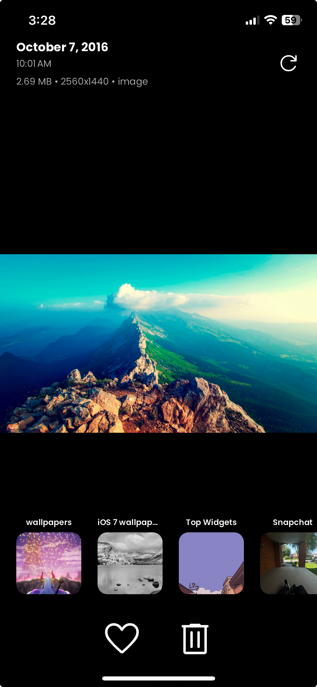

# Kaiga

**Kaiga** is an iOS app built with Flutter that simplifies the process of organizing your camera roll. With Kaiga, you can quickly manage your photos by either adding them to albums or deleting them with a single tap.

## Features

- **Organize with Ease**: Tap an album to sort photos in your camera roll.
- **Quick Deletions**: Delete unwanted images right from the main screen.
- **User-Friendly Interface**: A clean, intuitive design that makes photo organization fast and effortless.

## Screenshots

| Screenshot 1 | Screenshot 2 |
| --- | --- |
|  |  |

<!--   -->

## Installation

To run Kaiga locally, follow these steps:

1. Clone the repo:
   ```bash
   git clone https://github.com/warsam-e/kaiga.git
    ```
2. Navigate to the project directory:
    ```bash
    cd kaiga
    ```
3. Install the dependencies:
    ```bash
    flutter pub get
    ```
4. Run the app:
    ```bash
    flutter run
    ```

## Requirements
- iOS 11.0 or later
- Flutter SDK 3.4.3 or later

## Contributions 
Feel free to fork the repository and submit pull requests! If you encounter any issues or have feature requests, please open an issue.

